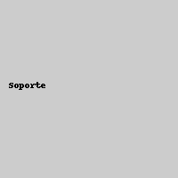

<!DOCTYPE html>
<html lang="es">
<head>
  <meta charset="UTF-8" />
  <meta name="viewport" content="width=device-width, initial-scale=1.0"/>
  <title>FDPEUL - Cuidamos de tus seres queridos</title>
  <link rel="stylesheet" href="estilos.css"/>
</head>
<body>
  <header>
    
Logan

    <nav>
      <ul>
        <li><a href="#">Inicio</a></li>
        <li><a href="#">Servicios</a></li>
        <li><a href="#">Quiénes somos</a></li>
        <li><a href="#">Testimonios</a></li>
        <li><a href="#" class="btn-llamada">Solicitar una llamada</a></li>
      </ul>
    </nav>
  </header>

  <section class="hero">
    

      <h1>Cuidamos de quienes siempre cuidaron de ti</h1>
      
Atención integral, humana y confiable para tus seres queridos.

      <a href="#" class="btn-primario">Descubre nuestros servicios</a>
    

  </section>

  <section class="servicios">
    

      
      <h3>Acompañamiento diario</h3>
    

    

      
      <h3>Soporte médico y emocional</h3>
    

    

      
      <h3>Asistencia en el hogar</h3>
    

  </section>

  <section class="testimonio">
    <blockquote>
      “El equipo ha sido de gran apoyo para mi madre. Sé que está en manos de profesionales que realmente se preocupan.”
      <footer>— María G., Colombia</footer>
    </blockquote>
    

      
      
      
    

  </section>

  <footer>
    
&copy; 2025 FDPEUL. Todos los derechos reservados.

  </footer>
</body>
</html>
